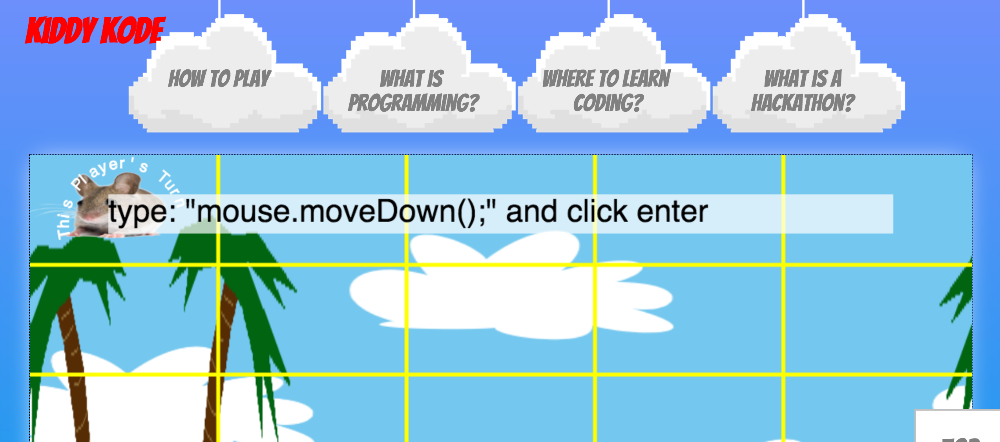

# [KiddyKode.](https://agile-reef-60707.herokuapp.com/)
**received “Honorable Mention” at Lehman College’s NSBE 2016 Hackathon**

a website to help young students learn about hackathons and how to code from curated technical websites. 

Created using JavaScript, HTML, and CSS. 

Deployed on Heroku using Node.js.

[https://agile-reef-60707.herokuapp.com/](https://agile-reef-60707.herokuapp.com/)